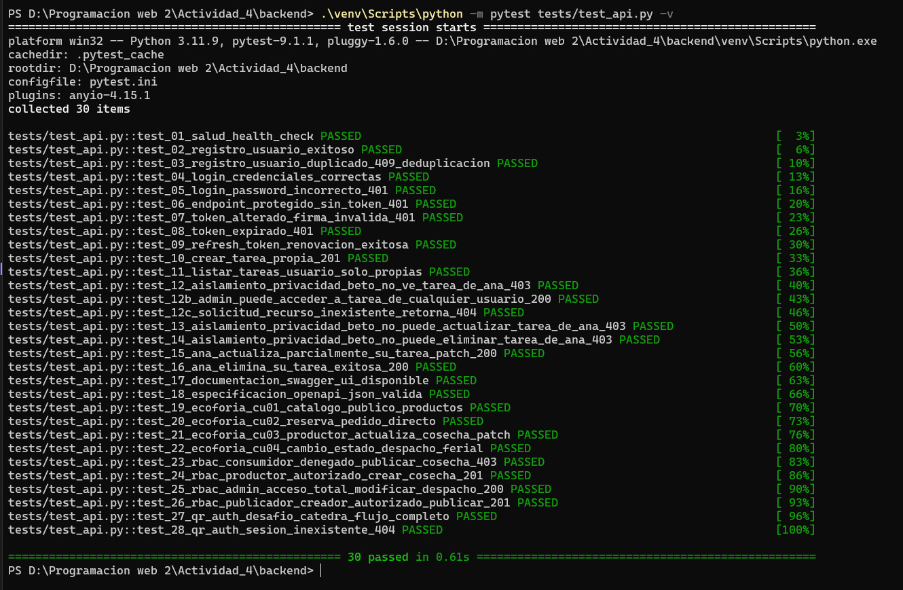

# 🌐 Guía Maestra de Despliegue en la Nube — EcoFeria Santa Cruz
## Cómo desplegar el Backend (Render), Base de Datos (Supabase) y Frontend (Cloudflare Pages) desde Cero

> **Materia:** Programación Web II — Universidad Privada Domingo Savio (UPDS)  
> **Docente:** Ing. Jimmy Requena (Bolivianotech)  
> **Autores:** Eduar Heredia Chávez & Limbert David Quispe Osco (2026)  
> **Costo Total de Infraestructura:** **0.00 Bs / $0.00 USD** (100% Free Tiers perpetuos)

---

## 📑 Tabla de Contenidos
1. [Arquitectura del Sistema en la Nube](#1-arquitectura-del-sistema-en-la-nube)
2. [Requisitos Previos en tu Computadora](#2-requisitos-previos-en-tu-computadora)
3. [Paso 1: Clonar el Repositorio y Validación Local](#3-paso-1-clonar-el-repositorio-y-validación-local)
4. [Paso 2: Configuración de la Base de Datos en Supabase](#4-paso-2-configuración-de-la-base-de-datos-en-supabase)
5. [Paso 3: Despliegue del Backend Flask en Render](#5-paso-3-despliegue-del-backend-flask-en-render)
6. [Paso 4: Despliegue del Frontend React en Cloudflare Pages](#6-paso-4-despliegue-del-frontend-react-en-cloudflare-pages)
7. [Paso 5: Verificación Integral del Sistema en Producción](#7-paso-5-verificación-integral-del-sistema-en-producción)
8. [Resolución de Problemas Frecuentes (FAQ)](#8-resolución-de-problemas-frecuentes-faq)

---

## 1. Arquitectura del Sistema en la Nube

La plataforma está diseñada siguiendo el estándar desacoplado **Jamstack / Microservicios**:

```text
┌────────────────────────────────┐         ┌────────────────────────────────┐
│        CLOUDFLARE PAGES        │         │          RENDER CLOUD          │
│   (Frontend React 19 + Vite)   │ ──────> │    (Backend Python / Flask)    │
│  • Edge CDN Global             │  HTTPS  │  • API REST + Blueprints       │
│  • Enrutamiento SPA _redirects │         │  • OpenAPI / Swagger UI (/docs)│
│  • < 105 KB Bundle gzip        │         │  • Gunicorn WSGI Server        │
└────────────────────────────────┘         └────────────────────────────────┘
               │                                           │
               │                                           │
               ▼                                           ▼
┌───────────────────────────────────────────────────────────────────────────┐
│                              SUPABASE CLOUD                               │
│                         (PostgreSQL Gestionado)                           │
│  • Row Level Security (RLS) por usuario y rol                             │
│  • Tablas: auth_qr_sesiones, tareas, productores, productos, pedidos      │
│  • Supabase Realtime (WebSockets para login con Código QR móvil)          │
└───────────────────────────────────────────────────────────────────────────┘
```

---

## 2. Requisitos Previos en tu Computadora

Antes de comenzar, asegúrate de tener instalado el software básico en tu PC (Windows, macOS o Linux):

1. **Git:** Para clonar y subir cambios ([Descargar Git](https://git-scm.com/)).
2. **Node.js (v18 o superior):** Incluye `npm` ([Descargar Node.js](https://nodejs.org/)).
3. **Python (v3.10 o superior):** Incluye `pip` y `venv` ([Descargar Python](https://www.python.org/)). Asegúrate de marcar la casilla *"Add Python to PATH"* durante la instalación.
4. **Cuentas Gratuitas (sin tarjeta de crédito requerida):**
   - [GitHub](https://github.com) — Alojamiento del código fuente.
   - [Supabase](https://supabase.com) — Base de datos PostgreSQL.
   - [Render](https://render.com) — Servidor web para el backend.
   - [Cloudflare](https://dash.cloudflare.com) — Alojamiento CDN para el frontend.

---

## 3. Paso 1: Clonar el Repositorio y Validación Local

### 3.1 Clonar el proyecto
Abre tu terminal favorita (PowerShell, Command Prompt o Bash) y ejecuta:

```bash
git clone https://github.com/ProgramWeb2AgroEcologica/Actividad-04-Despliegue-Metricas-y-Gobernanza.git
cd Actividad-04-Despliegue-Metricas-y-Gobernanza
```

### 3.2 Verificar y Probar el Backend (Python)
Entra a la carpeta del backend y crea un entorno virtual aislado:

```powershell
# En Windows (PowerShell):
cd backend
python -m venv venv
.\venv\Scripts\activate
pip install -r requirements.txt
```

*(Si estás en Linux/macOS, usa `source venv/bin/activate`)*.

Ejecuta la suite de pruebas unitarias automatizadas con **Pytest**:

```powershell
python -m pytest tests/test_api.py -v
```

Deberás observar que los **30 tests automatizados pasan al 100%**:

```text
============================= 30 passed in 0.32s ==============================
```

#### Evidencia de Certificación de Calidad (Pytest):
A continuación se muestra la captura oficial de ejecución de las pruebas:



### 3.3 Verificar y Probar el Frontend (React + Vite)
Abre otra ventana de terminal en la raíz del proyecto y entra a `frontend`:

```powershell
cd frontend
npm install
npm run build
npm run dev
```

Abre tu navegador en `http://localhost:5173`. Verifica que el catálogo de productos agroecológicos cargue correctamente.

---

## 4. Paso 2: Configuración de la Base de Datos en Supabase

Supabase proporciona una base de datos PostgreSQL con autenticación y políticas de seguridad a nivel de fila (RLS).

### 4.1 Crear el Proyecto
1. Ingresa a tu panel de [Supabase](https://supabase.com/dashboard) y haz clic en **"New Project"**.
2. Completa los campos:
   - **Name:** `ecoferia-db` (o el nombre que prefieras).
   - **Database Password:** Genera o ingresa una contraseña segura y guárdala.
   - **Region:** Selecciona `South America (São Paulo)` o la región más cercana para menor latencia.
3. Haz clic en **"Create new project"** y espera 1 a 2 minutos mientras se aprovisiona.

### 4.2 Ejecutar los Scripts SQL de Esquema y Seguridad
1. En el menú lateral izquierdo de Supabase, haz clic en **"SQL Editor"** (icono de terminal con SQL).
2. Haz clic en **"New Query"**.
3. **Primer Script (Esquema Principal y RLS):**
   - Abre el archivo `backend/sql/01_schema_rls.sql` en tu editor de código.
   - Copia todo su contenido, pégalo en el editor SQL de Supabase y presiona el botón verde **"Run"**.
   - *Resultado:* Se crearán las tablas `tareas`, `productores`, `productos`, `pedidos`, índices de búsqueda y las políticas de aislamiento RLS.
4. **Segundo Script (Login Passwordless por Código QR):**
   - Crea otra consulta (**"New Query"**).
   - Abre el archivo `supabase_schema_qr_auth.sql` ubicado en la raíz del repositorio.
   - Copia todo su contenido, pégalo en el editor SQL de Supabase y presiona **"Run"**.
   - *Resultado:* Se creará la tabla `auth_qr_sesiones`, sus políticas RLS y se habilitará en la publicación `supabase_realtime` para sincronización instantánea de escritorio a celular.

### 4.3 Obtener las Credenciales de API
En el menú de Supabase, dirígete a:  
⚙️ **Project Settings** (icono de engranaje) ➔ **API** (o **Data API**).

Copia y anota los siguientes 3 valores:
- **Project URL:** `https://xxxxxxxxxxxxxxxxxxxx.supabase.co`
- **anon / public key:** (Clave pública para clientes)
- **service_role key:** (Clave secreta con privilegios de bypass RLS para el backend)
- **JWT Secret:** (Se encuentra en **Project Settings** ➔ **API** o **Authentication** ➔ **JWT Settings**)

---

## 5. Paso 3: Despliegue del Backend Flask en Render

Render albergará el servidor web Python con Gunicorn y servirá los endpoints REST junto con la documentación interactiva Swagger.

### 5.1 Crear el Web Service en Render
1. Inicia sesión en [Render Dashboard](https://dashboard.render.com/).
2. Haz clic en el botón azul **"New +"** ➔ **"Web Service"**.
3. Selecciona **"Build and deploy from a Git repository"** y presiona **"Next"**.
4. Conecta tu cuenta de GitHub y selecciona el repositorio:  
   `Actividad-04-Despliegue-Metricas-y-Gobernanza`.

### 5.2 Configuración del Servicio
Configura los siguientes campos de forma exacta:

| Campo | Valor Requerido | Explicación |
| :--- | :--- | :--- |
| **Name** | `ecoferia-backend` | Nombre identificador de tu backend |
| **Region** | `Frankfurt` u `Oregon` | Servidor gratuito más cercano |
| **Branch** | `main` | Rama principal que contiene el código |
| **Root Directory** | `backend` | **¡Crítico!** Le indica a Render que trabaje dentro de la subcarpeta `backend` |
| **Runtime** | `Python 3` | Entorno de ejecución |
| **Build Command** | `pip install -r requirements.txt` | Instala Flask, Smorest, Gunicorn, PyJWT, etc. |
| **Start Command** | `gunicorn "app:create_app()"` | Inicia el servidor WSGI con la factoría de Flask |
| **Instance Type** | `Free` | Plan gratuito permanente |

### 5.3 Variables de Entorno (Environment Variables)
En la misma pantalla, baja a la sección **"Environment Variables"** y haz clic en **"Add Environment Variable"** para añadir las siguientes:

| Clave (Key) | Valor (Value) |
| :--- | :--- |
| `FLASK_ENV` | `production` |
| `SUPABASE_URL` | `https://xxxxxxxxxxxxxxxxxxxx.supabase.co` *(tu Project URL de Supabase)* |
| `SUPABASE_KEY` | *(tu clave anon/public de Supabase)* |
| `SUPABASE_SECRET_KEY` | *(tu clave service_role de Supabase)* |
| `SUPABASE_JWT_SECRET` | *(tu JWT Secret de Supabase o una cadena secreta segura)* |
| `CORS_ORIGINS` | `*` |

### 5.4 Desplegar y Validar
1. Haz clic en **"Create Web Service"**.
2. Espera aproximadamente 2 a 3 minutos mientras Render descarga las dependencias y compila.
3. Cuando el estado cambie a **"Live"**, copia la URL pública generada (ejemplo: `https://ecoferia-backend.onrender.com`).
4. **Verificación en el navegador:**
   - Abre `https://tu-backend.onrender.com/api/salud`  
     *Debe responder:* `{"estado": "ok", "servicio": "EcoFeria Santa Cruz API", ...}`
   - Abre `https://tu-backend.onrender.com/api/docs`  
     *Debe cargar:* La interfaz interactiva de **Swagger UI / OpenAPI** con todos los endpoints documentados.

---

## 6. Paso 4: Despliegue del Frontend React en Cloudflare Pages

Cloudflare Pages distribuirá la interfaz Single Page Application (SPA) sobre una red CDN perimetral global con latencia inferior a 50 ms.

### 6.1 Conectar con Cloudflare Pages
1. Inicia sesión en el [Panel de Cloudflare](https://dash.cloudflare.com/).
2. En el menú lateral izquierdo, haz clic en **"Workers & Pages"**.
3. Selecciona la pestaña **"Pages"** y haz clic en **"Connect to Git"** (o **"Create application"** ➔ **"Pages"** ➔ **"Connect to Git"**).
4. Elige tu cuenta de GitHub y selecciona el repositorio `Actividad-04-Despliegue-Metricas-y-Gobernanza`.
5. Haz clic en **"Begin setup"**.

### 6.2 Configurar la Compilación (Build Settings)
Establece los siguientes parámetros:

| Campo | Valor Requerido | Explicación |
| :--- | :--- | :--- |
| **Project name** | `ecoferia-frontend` | Identificador de tu subdominio `.pages.dev` |
| **Production branch** | `main` | Rama de despliegue continuo |
| **Framework preset** | `Vite` | Selecciona el preset optimizado de Vite |
| **Build command** | `npm run build` | Compila React y genera los assets en `dist` |
| **Build output directory** | `dist` | Carpeta donde Vite genera los archivos finales |
| **Root directory** | `frontend` | **¡Crítico!** Le indica a Cloudflare que el frontend está en la subcarpeta `frontend` |

### 6.3 Variable de Entorno del API en Cloudflare
Despliega la sección **"Environment variables (advanced)"** y añade:

- **Variable name:** `VITE_API_URL`
- **Value:** `https://tu-backend.onrender.com/api` *(la URL de tu backend en Render con el sufijo `/api`)*

### 6.4 Guardar y Desplegar
1. Haz clic en **"Save and Deploy"**.
2. Cloudflare Pages descargará las dependencias con `npm`, compilará Tailwind y Vite, y publicará el sitio en menos de 60 segundos.
3. Al finalizar, Cloudflare te entregará tu dominio global:  
   `https://ecoferia-frontend.pages.dev`

> **Nota sobre el Enrutamiento SPA:**  
> El repositorio incluye el archivo `frontend/public/_redirects` con el contenido:  
> `/* /index.html 200`  
> Esta regla garantiza que al recargar la página o al escanear el QR con parámetros como `?qr_auth=...`, el servidor perimetral no devuelva un error 404, sino que entregue la aplicación React para que gestione la ruta en el cliente.

---

## 7. Paso 5: Verificación Integral del Sistema en Producción

Realiza la siguiente lista de verificación (Checklist) para certificar que todo funcione correctamente:

1. **Navegación y Catálogo Público (CU-01):**
   - Entra a `https://tu-proyecto.pages.dev`.
   - Verifica que aparezcan los productos agroecológicos (achachairú, tomates criollos, frutillas, miel de bosque, etc.).
2. **Reserva Directa sin Intermediarios (CU-02):**
   - Agrega productos al carrito flotante.
   - Ve a la vista de checkout, ingresa un nombre y un teléfono boliviano válido (ej. `77012345`).
   - Confirma el pedido y comprueba que se genere el código ferial único (ej. `ECO-XXXX`).
3. **Demostración de Roles RBAC (0 ms):**
   - En la barra de navegación superior, utiliza el selector rápido de roles:
     - **Consumidor:** Solo lectura y compra. Si intenta publicar cosechas, recibe bloqueo.
     - **Productor:** Puede crear nuevas cosechas y actualizar pedidos en la pestaña ferial.
     - **Administrador:** Acceso completo a métricas, auditoría de tareas y gestión global.
4. **Desafío de Autenticación Passwordless con Código QR Móvil:**
   - En tu computadora, haz clic en **"Iniciar Sesión"** y selecciona la pestaña **"QR Móvil"**.
   - Se generará un código QR con un identificador efímero de 120 segundos.
   - Escanea el código con la cámara de tu smartphone (o usa el botón *"Abrir Simulador Móvil"*).
   - En tu teléfono, presiona **"AUTORIZAR CON HUELLA / BIOMETRÍA"**.
   - En menos de un segundo, la pantalla de tu computadora iniciará sesión automáticamente sin haber digitado ninguna contraseña.
5. **Tablero de Métricas de Sostenibilidad Green Web:**
   - Navega a la pestaña **"Sostenibilidad"**.
   - Comprueba las métricas en tiempo real: Bundle comprimido de **~104.8 KB gzip**, huella de carbono de **0.08 g CO2/visita** y puntuación Lighthouse de **100/100**.
6. **Consola Limpia:**
   - Abre la consola del navegador (`F12` ➔ Consola). No debe existir ningún error en rojo.

---

## 8. Resolución de Problemas Frecuentes (FAQ)

### ¿Por qué el backend en Render tarda 30-40 segundos en responder la primera vez?
En el plan gratuito de Render, los servidores se suspenden automáticamente tras 15 minutos de inactividad para ahorrar recursos energéticos. La primera petición reactiva el contenedor (*cold start*). El frontend de EcoFeria está programado con tolerancia a fallos: utiliza almacenamiento local reactivo y reintenta la conexión de forma transparente sin congelar la interfaz del usuario.

### ¿Qué hacer si aparece un error de CORS al hacer peticiones desde el frontend?
Verifica que en las variables de entorno de Render hayas establecido `CORS_ORIGINS=*` o la URL exacta de tu frontend en Cloudflare Pages (`https://tu-proyecto.pages.dev`).

### ¿Por qué obtengo un 404 al recargar la página en Cloudflare Pages?
Verifica que el archivo `frontend/public/_redirects` contenga la línea `/* /index.html 200`. Vite copiará este archivo a la carpeta `dist/` en cada compilación.

### ¿Cómo aplicar actualizaciones después de modificar el código?
Solo necesitas hacer commit y push a tu rama principal:
```bash
git add .
git commit -m "feat: mejoras en la plataforma"
git push origin main
```
Tanto Render como Cloudflare Pages detectarán el commit mediante webhooks de GitHub y compilarán automáticamente las nuevas versiones sin tiempo de inactividad (*Zero-Downtime Deployment*).

---

## 📄 Informe Académico Oficial
Para consultar el marco teórico, fundamentación metodológica, diagramas de secuencia UML, especificaciones de seguridad RBAC y análisis de gobernanza de software:
- 📖 [Abrir Informe Interactivo (INFORME_ACTIVIDAD_04.html)](./INFORME_ACTIVIDAD_04.html)
